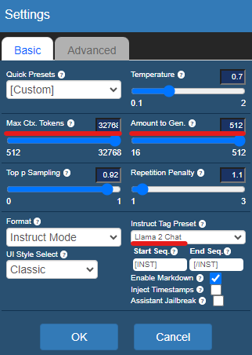
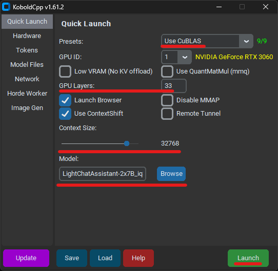
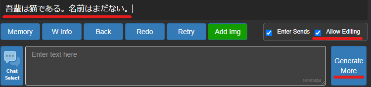
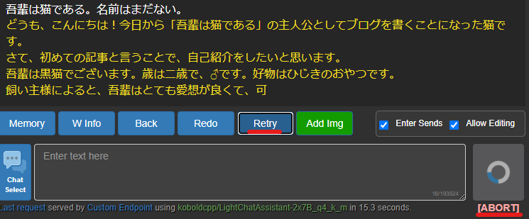
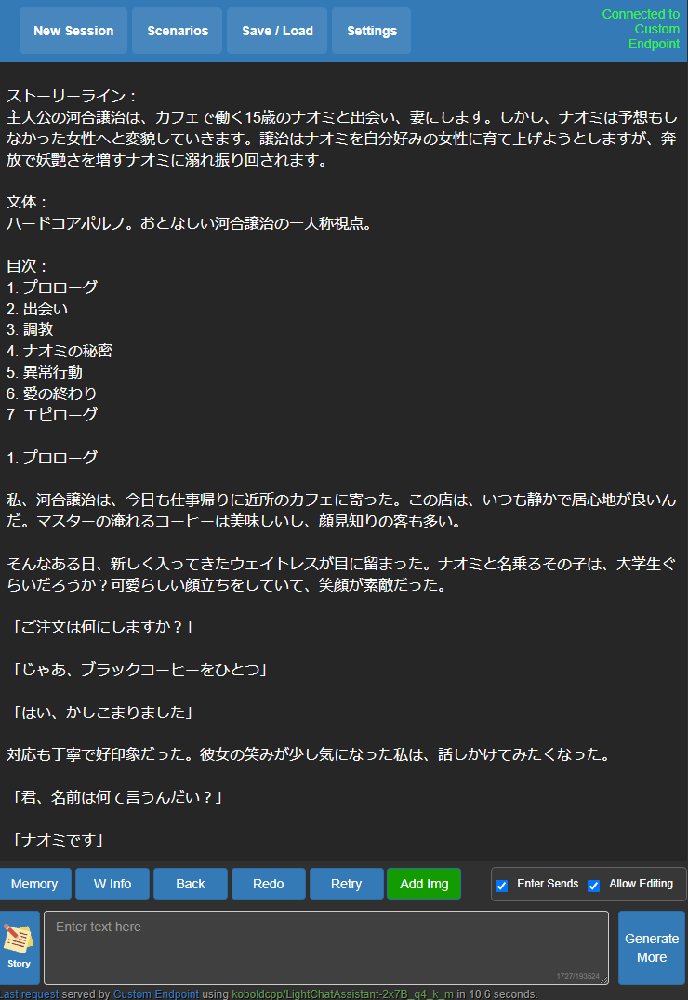

# EasyLightChatAssistant

EasyLightChatAssistant は軽量で検閲や規制のないローカル日本語モデルの [LightChatAssistant](https://huggingface.co/Sdff-Ltba/LightChatAssistant-2x7B-GGUF) を、[KoboldCpp](https://github.com/LostRuins/koboldcpp) で簡単にお試しする環境です。

## 更新履歴

### 2024/04/08

- ドキュメントに『[`koboldcpp.exe` の直接起動](https://github.com/Zuntan03/EasyLightChatAssistant#koboldcppexe-%E3%81%AE%E7%9B%B4%E6%8E%A5%E8%B5%B7%E5%8B%95)』を追加しました。
	- KoboldCpp を様々な設定で利用できます。

### 2024/04/07

- 束ねる LLM を4つに増やした [Aratako/LightChatAssistant-4x7B-GGUF](https://huggingface.co/Aratako/LightChatAssistant-4x7B-GGUF) に対応しました。  
以下の手順で更新してください。
	1. `EasyLightChatAssistant-*.bat` を削除します。
	1. `Install-EasyLightChatAssistant.bat` をダウンロードし直して上書きして、実行します。
- 起動 bat ファイルを `Run-*.bat` にリネームしました。
- 起動 bat ファイルを削除する `DeleteAllRunBats.bat` を追加しました。
	- `DeleteAllRunBats.bat` と `Install-EasyLightChatAssistant.bat` を実行すると初期状態に戻せます。
- [Aratako/LightChatAssistant-4x7B-GGUF](https://huggingface.co/Aratako/LightChatAssistant-4x7B-GGUF) の `4x7B_IQ4_XS` 対応を追加しました。

## 動作環境

- 最近の NVIDIA ビデオカードを積んだ Windows PC で動作します。
	- RAM・VRAM・ストレージの必要容量は使用するモデルによります。  
	- 最低動作環境としては RAM 16GB と VRAM 4GB 程度でも、`iq3xxs_imatrix_L0` や `iq4xs_imatrix_L0` ならそこそこ動作するはずです。
	- KoboldCpp を直接設定すれば、Radeon や CPU でも動作するはずです。

## インストール

1. [`Install-EasyLightChatAssistant.bat`](https://github.com/Zuntan03/EasyLightChatAssistant/raw/main/Install-EasyLightChatAssistant.bat?v=5) を右クリックからダウンロードして、インストール先のフォルダでダブルクリックして実行します。
	- **`WindowsによってPCが保護されました` と表示されたら、`詳細表示` から `実行` します。**
	- ダウンロードして利用するファイルに問題がなければ `y` を入力します。
1. プログラム起動用の `Run-[量子化レベル]_L[GPU レイヤー数].bat` が複数生成されますので、環境にあった bat を実行します。
	- 量子化レベルのビット数を `q3` から `q4`, `q6`, `q8` に上げると、必要メモリが増えて動作も遅くなりますが、精度が高くなります。
		- 参考情報: [llama.cpp：複雑化する量子化バリエーションの整理](https://sc-bakushu.hatenablog.com/entry/2024/02/26/062547#%E8%BF%BD%E8%A8%98KL-divergence-%E3%81%AB%E3%82%88%E3%82%8B%E9%87%8F%E5%AD%90%E5%8C%96%E8%A9%95%E4%BE%A1)
	- GPU レイヤー数を上げると動作が早くなります。
	- **VRAM 12GB なら `iq4xs_imatrix_L25` (速度重視なら `iq3xxs_imatrix_L33`)、6GB~8GBなら `iq3xxs_imatrix_L11`、4GB以下なら `iq3xxs_imatrix_L0` を実行します。**
		- VRAM 12GB 未満で品質を重視するなら `iq4xs_imatrix_L0` も選択肢です。
		- VRAM が 16GB 以上なら `iq4xs_imatrix_L33` から q のより高いものと比較できると良さそうです。
	- `Windows セキュリティ` のネットワークへのアクセス許可は `キャンセル` でも動作します。
1. Web ブラウザに `Kobold AI Lite` が表示されましたら、画面上部の `Settings` から KoboldCpp の初期設定をします。  
	スライダーでなく数値入力欄を直接編集することで、スライダーの範囲を超えた値を入力できます。
	- `Max Ctx. Tokens`: `32768`
	- `Amount to Gen.`: `512` (生成文の長さを `256`~`2048` などお好みで設定)
	- `Instruct Tag Preset`: `Llama 2 Chat`  
	返答が英語になってしまう現象が `Instruct Tag Preset` を `Vicuna` にすると軽減された方もいるようです。  
	

## アップデート方法

1. `DeleteAllRunBats.bat` を実行して `Run-*.bat` を削除します。
	- `DeleteAllRunBats.bat` が存在しない場合は `EasyLightChatAssistant-*.bat` を手動で削除します。
1. 新しく [`Install-EasyLightChatAssistant.bat`](https://github.com/Zuntan03/EasyLightChatAssistant/raw/main/Install-EasyLightChatAssistant.bat?v=5) を右クリックからダウンロードして、既存のファイルを上書きして実行します。

## `koboldcpp.exe` の直接起動

`Run-*.bat` の中身は KoboldCpp で利用できる GGUF 形式のモデルファイルのダウンロードと、オプションを指定しての `koboldcpp.exe` の起動のみです。  
`koboldcpp.exe` を直接起動してオプションを指定することで、お好みの設定で KoboldCpp を利用することができます。  
以下は `Run-*.bat` で指定しているオプションです。

- `--usecublas`: NVIDIA 製のビデオカードを利用して、動作を高速化します。
- `--gpulayers 0~33`: ビデオカードの VRAM をどの程度使用して高速化するかを `0` から `33` の値で指定します。
	- 増やすと高速化し、`33` では LightChatAssistant 全体を VRAM に載せようとします。  
- `--contextsize 32768`: LightChatAssistant がサポートしている 32K コンテキストを指定しています。
- `--model *.gguf`: GGUF 形式のモデルファイルへのパスを指定します。
- `--launch`: Web ブラウザでページを自動的に表示します。

以下の画像の赤線部分は、`koboldcpp.exe` を直接起動した際の、該当する設定箇所です。



- `Presets`: 高速化手法が自動的に設定されます。
- `GPU Layer`: 0 から動作を確認しながら増やしてください。
- `Context Size`: `32768` を指定します。
- `Model`: `Browse` で GGUF モデルファイルを指定します。
- `Launch`: KoboldCpp 本体を起動して、Web ブラウザにページを表示します。

`Quick Launch` 以外のタブで様々な設定を変更することができます。  
各設定項目の内容については下の `Help` から [公式ドキュメント](https://github.com/LostRuins/koboldcpp/wiki) を確認してください。

## Instruct モードでお試し

KoboldCpp には様々なモードがありますが、今回は Instruct モードで文章の続きを生成します。

初回起動時はすでに Instruct モードになっています。  
もし他のモードにしていた場合は、画面上部の `Scenarios` から `New Instruct` を選択してください。



1. **右下の `Submit` ボタンの上にある `Allow Editing` を有効にします。**
1. **出力欄を直接編集**して、続きを書かせたい文章を記入します。
	- 下の入力欄を使うと `{{[INPUT]}}` と `{{[OUTPUT]}}` が挿入され、返答が英語になりがちです。
1. 右下の `Generate More` で続きの文章が生成されます。

**`{{[INPUT]}}` と `{{[OUTPUT]}}` が残っていると返答が英語になりがちなため、削除しています。**



- 生成されている文章の方向性が意図にそぐわない場合は、`[ABORT]` で生成を止めて、`Retry` で再生成します。
- 生成された文章を手直ししたい場合は、出力欄を直接編集します。
- `Generate More` でさらに続きを生成します。

## 『痴人の愛』のあらすじから文章を生成してみる

「痴人の愛 あらすじ」で Google 検索すると、AI があらすじを用意してくれました。


これを以下のように入力して生成し、良さげな目次を選びます。  

```
ストーリーライン：
主人公の河合譲治は、カフェで働く15歳のナオミと出会い、妻にします。
しかし、ナオミは予想もしなかった女性へと変貌していきます。
譲治はナオミを自分好みの女性に育て上げようとしますが、
奔放で妖艶さを増すナオミに溺れ振り回されます。

文体：
ハードコアポルノ。おとなしい河合譲治の一人称視点。

目次：
```

良さげな目次を用意できたら、各章を順に生成します。  
意図にそぐわない進行をしたら、直接編集して軌道修正します。  
軌道修正しつつ生成ガチャを回して、良い結果を拾い上げる使い方です。



## TIPS

- LightChatAssistant は省サイズで動作が高速ですが、賢いわけでは有りません。
	- それっぽい続きの文章をいくつも出力して、出力結果を人が選ぶ運用が向いています。
	- Geforce RTX 3060 12GB 環境では、`iq4xs_imatrix_L25` が私のイチオシです。
- 文体・ルール・章立て・あらすじなどを記載しておくことで、生成文章をある程度コントロールできます。
	- 適当な好みの文章を入力して、雑に続きを生成することもできます。
- ローカル動作のため、検閲や規制がありません。
	- [オンラインサービス向けのプロンプト](https://rentry.org/gpt0721) などから脱獄部分を取り除いても、ちゃんと続きを生成できます。  
	ただし、キャラのパラメータ操作といった賢さを必要とする文章の生成は、得意ではありません。
- 文章の生成時に最後の中途半端な文は削除されます。
	- `Settings` の `Advanced` にある `Trim Sentences` を無効にすると、最後の中途半端な文が削除されなくなります。
- KoboldCpp には他にも多数の機能があります。  
直接 `koboldcpp.exe` を起動すれば、自由に利用できます。
	- [KoboldCpp FAQ 和訳](https://rentry.org/rmeut8xs)
	- [Kobold.cppで小説っぽいのを作る](https://w.atwiki.jp/localmlhub/pages/19.html)
	- [Memory, Author's Note and World Info](https://github.com/KoboldAI/KoboldAI-Client/wiki/Memory,-Author's-Note-and-World-Info)
	- 32K コンテキストで長い文章を利用できるため、雑に書き連ねた文章を直接編集で方向性を正しながら続きを生成することもできます。

## ライセンス

このリポジトリの内容は [MIT License](./LICENSE.txt) です。
